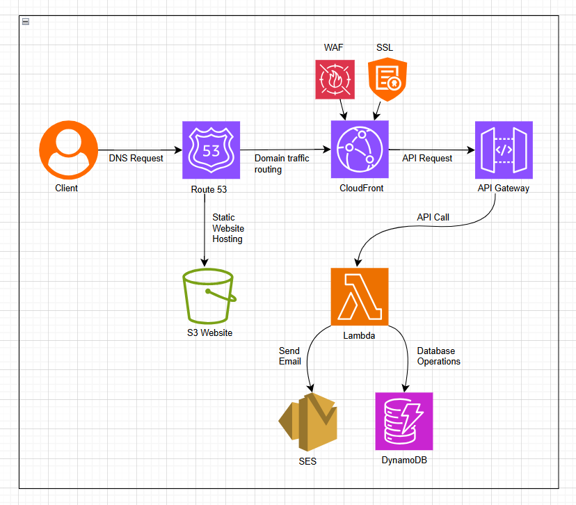

# 🌥️ Cloud Resume + Contact System (AWS Serverless Project)

This is a **cloud-based resume project** that showcases my CV and allows users to send me messages via a contact form. The entire system is hosted using AWS services in a **serverless and scalable architecture**, following the **AWS Well-Architected Framework**.

---

## 🔧 Technologies & Services Used

- **Amazon S3**: Static website hosting (for resume HTML/CSS/JS files)
- **Amazon Route 53**: Domain registration and DNS routing
- **AWS Certificate Manager (ACM)**: For issuing an SSL/TLS certificate
- **Amazon CloudFront**: Global CDN for caching and secure HTTPS delivery
- **AWS WAF (Optional)**: Protecting the site from common web attacks
- **AWS Lambda**: Backend function to receive and process contact form submissions
- **Amazon API Gateway**: Expose the Lambda as a public REST endpoint
- **Amazon DynamoDB**: Store submitted messages in a NoSQL table
- **Amazon SNS (Optional)**: Send me an email notification when a message is received
- **IAM**: Roles and permissions to secure access between services

---

## 🧠 System Architecture

The architecture is divided into two main parts:

### 🖥️ Frontend (Static Hosting)

- Hosted on **Amazon S3** with public access blocked.
- Delivered securely through **Amazon CloudFront**.
- Secured with **ACM certificate** for HTTPS using a custom domain.
- DNS managed via **Route 53**.

### 📬 Backend (Serverless Contact Form)

- The contact form calls an **API Gateway endpoint**.
- API Gateway triggers a **Lambda function**.
- The Lambda function:
- Validates the form data.
- Saves it in a **DynamoDB table**.
- (Optional) Sends a notification via **SNS**.

---

## 🛡️ Security Measures

- ✅ HTTPS enforced via **ACM + CloudFront**  
- ✅ Public access blocked on S3  
- ✅ IAM roles follow **least privilege principle**  
- ✅ Input validation in Lambda  
- ✅ **WAF** can be enabled on CloudFront to block malicious traffic

---

## 🎯 Features

- 🧾 Professional resume and project showcase
- 📩 Contact form for direct communication
- ☁️ Fully serverless and auto-scalable
- 🌐 Global delivery via CloudFront CDN
- 🔐 End-to-end encryption with HTTPS

---

## 🖼️ CloudFront Integration (NEW ✅)

We've enhanced the project by integrating **Amazon CloudFront** for better performance and security:

- Created a **CloudFront distribution** with S3 as the origin
- Enabled SSL with a custom domain via ACM
- Configured **default root object** (`index.html`)
- Enabled caching policies for optimized delivery
- (Optional) Linked **WAF** to block suspicious traffic

This improves **site speed, availability, and protection** across global edge locations.

---

## 📸 Architecture Diagram

The full project architecture is shown in this visual representation:

---

## 🏁 Final Notes

This is part of my practical journey while preparing for the **AWS Certified Solutions Architect – Associate** certification. It demonstrates hands-on experience with AWS core services and serverless application design.

---

## Made by

**Rafat Ashraf**  

📧 raftashrf17@gmail.com  
🔗 [linkedin.com/in/rafat-devops](https://linkedin.com/in/rafat-devops)

---
